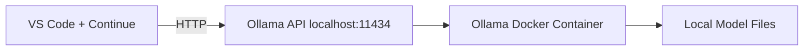

# Local LLM for VS Code (Open Source)

Run your own open-source LLM locally with Ollama and use it inside VS Code through Continue.

## Important note about GitHub Copilot

The official GitHub Copilot service is not designed to be directly redirected to a self-hosted local OSS model endpoint in standard usage.

This repository gives you a Copilot-like workflow in VS Code with local models by using Continue + Ollama.

## What you get

- Local model runtime in Docker.
- CPU-friendly default model configuration.
- Two Continue model profiles out of the box: fast and strong.
- One-command scripts for setup, start, stop, pull-model, and health checks.
- Continue configuration template for VS Code.
- Troubleshooting and architecture docs.

## Architecture



If Mermaid is not rendered in your viewer, use this fallback:

```text
VS Code + Continue
  |
  | HTTP (localhost:11434)
  v
Ollama API
  |
  v
Ollama Docker Container
  |
  v
Local Model Files (persistent Docker volume)
```

More details: [docs/ARCHITECTURE.md](docs/ARCHITECTURE.md)

## Prerequisites

- Linux (tested target).
- Docker Engine with Docker Compose plugin.
- Internet access for first model download.
- Recommended machine for CPU-only:
  - RAM: 16 GB recommended (8 GB minimum for small quantized models)
  - Free disk: 10-20 GB

## Repository structure

- `docker-compose.yml`: Ollama runtime.
- `.env.example`: default settings.
- `scripts/setup.sh`: environment checks and bootstrap.
- `scripts/start.sh`: start Ollama service.
- `scripts/stop.sh`: stop Ollama service.
- `scripts/pull-model.sh`: download model into persistent volume.
- `scripts/health.sh`: endpoint + generation validation.
- `.continue/config.json`: Continue model template.
- `docs/continue-config.md`: Continue setup guide.
- `docs/TROUBLESHOOTING.md`: common issues and fixes.

## Quick start

```bash
cd /home/kbohn/repos/local-llm-vscode
chmod +x scripts/*.sh
./scripts/setup.sh
./scripts/start.sh
./scripts/pull-model.sh
./scripts/health.sh
```

Expected first run:
- Model pull can take several minutes depending on network and model size.
- After pull finishes, health check should print a response containing `local-llm-ready`.

## Detailed setup

### 1. Create environment file

`./scripts/setup.sh` creates `.env` from `.env.example` if needed.

Default values:

```dotenv
OLLAMA_PORT=11434
DEFAULT_MODEL=qwen2.5-coder:7b-instruct-q4_K_M
OLLAMA_KEEP_ALIVE=10m
```

### 2. Start runtime

```bash
./scripts/start.sh
```

Verify container:

```bash
docker compose ps
```

### 3. Pull a model

Default model from `.env`:

```bash
./scripts/pull-model.sh
```

Or choose explicitly:

```bash
./scripts/pull-model.sh qwen2.5-coder:7b-instruct-q4_K_M
```

Recommended second profile model:

```bash
./scripts/pull-model.sh llama3.1:8b-instruct-q4_K_M
```

### 4. Validate local API and model generation

```bash
./scripts/health.sh
```

### 5. Connect VS Code

1. Install Continue extension in VS Code:
   - ID: `Continue.continue`
2. Open Continue configuration and use `.continue/config.json` from this repo as template.
3. Ensure `apiBase` matches your local port, default:
   - `http://localhost:11434`
4. Start a chat in Continue and ask a short prompt to verify response.

Full guide: [docs/continue-config.md](docs/continue-config.md)

### Continue profiles included in this repository

The template at `.continue/config.json` includes:

- Fast Profile - Qwen2.5 Coder 7B: lower latency, best for autocomplete and short edits.
- Strong Profile - Llama 3.1 8B: better reasoning quality, better for complex refactors and architecture prompts.

## Model recommendations (CPU-first)

- Default: `qwen2.5-coder:7b-instruct-q4_K_M`
- Alternatives:
  - `codellama:7b-instruct`
  - `deepseek-coder:6.7b`
  - `llama3.1:8b-instruct-q4_K_M`

Tips:
- Smaller quantized models are faster and require less RAM.
- Use larger models only if your machine can handle them.

## Operational commands

Start:

```bash
./scripts/start.sh
```

Stop:

```bash
./scripts/stop.sh
```

Check health:

```bash
./scripts/health.sh
```

List models inside container:

```bash
docker compose exec ollama ollama list
```

Remove a model:

```bash
docker compose exec ollama ollama rm <model-tag>
```

## Troubleshooting

See: [docs/TROUBLESHOOTING.md](docs/TROUBLESHOOTING.md)

Quick checks:

```bash
curl http://localhost:11434/api/tags
docker compose logs -f ollama
```

## Security and privacy

- All inference runs locally on your machine.
- Do not expose Ollama port publicly without additional controls.
- Review prompts and local code policy before sharing outputs.

## Cleanup

Stop stack:

```bash
./scripts/stop.sh
```

If you want to remove runtime data and downloaded models:

```bash
docker compose down -v
```

## FAQ

Q: Can I use this directly as official GitHub Copilot backend?
A: Not in standard supported Copilot configuration. Use Continue for local-model integration in VS Code.

Q: Can I run without Docker?
A: Yes, by installing Ollama natively, but this repository is Docker-first for reproducibility.

Q: Why is the first run slow?
A: Initial model download and warm-up are the main causes; later runs are much faster.

## Next improvements

- Add optional NVIDIA GPU profile.
- Add multi-model switch helper script.
- Add benchmark script for tokens/sec and latency.
