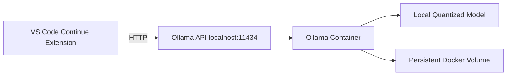

# Architecture

This repository runs a local open-source LLM with Ollama in Docker and connects VS Code through the Continue extension.

## Components

- VS Code Continue extension: chat, edit, and autocomplete UX in the editor.
- Ollama API: local endpoint compatible with Ollama clients at `http://localhost:11434`.
- Ollama container: hosts model runtime.
- Persistent volume: keeps downloaded models between restarts.

## Why this architecture

- Local-only data path.
- Easy startup and shutdown with Docker Compose.
- Small CPU-friendly model by default.
- Clear separation between editor and model runtime.

## Limits

- Official GitHub Copilot cannot be directly reconfigured to use your local OSS model endpoint in the standard product setup.
- Continue is used as the practical and open-source integration path for local models in VS Code.
